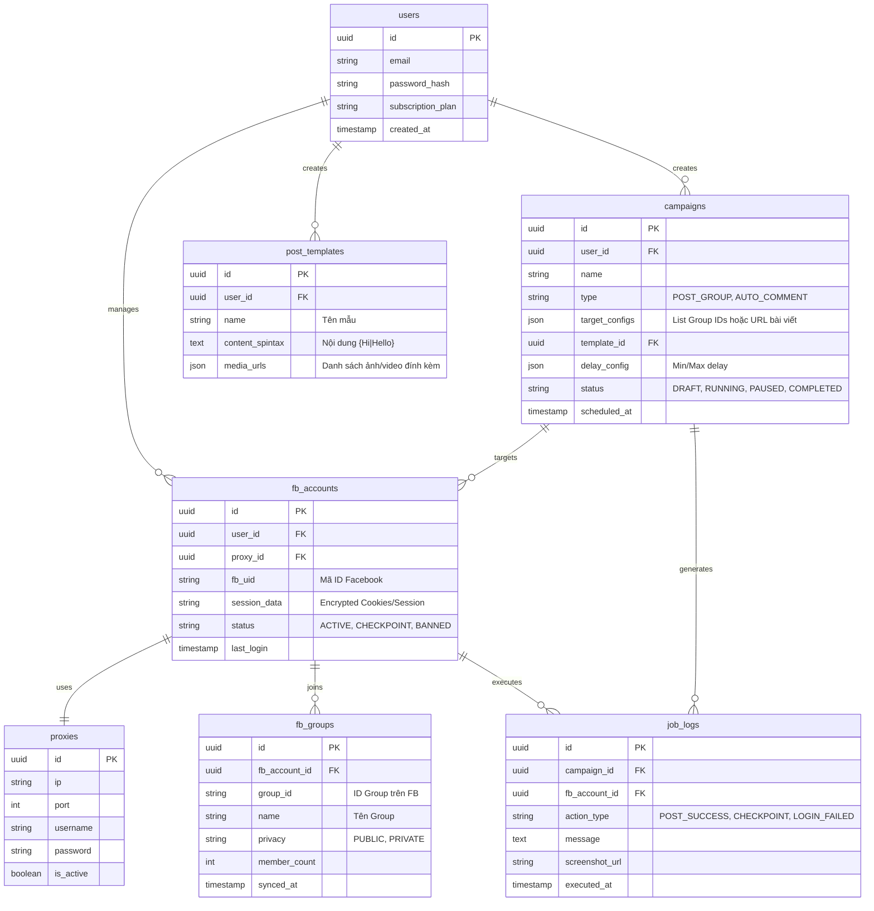

# Database Schema Design (High-Level)
Dự án: Facebook Automation Tool
Database: PostgreSQL

Tài liệu này định nghĩa cấu trúc dữ liệu cho dự án, đảm bảo khả năng quản lý hàng loạt tài khoản Facebook, chiến dịch và lưu trữ logs lịch sử chạy.

## Entity-Relationship Diagram (ERD)

---

## Chi tiết các Bảng (Tables)

### 1. Bảng `users` (Người dùng Hệ thống)
Chứa thông tin của người dùng đăng nhập vào hệ thống quản lý (Dashboard). Sẵn sàng cho việc mở rộng SaaS sau này (phân biệt gói Free, Premium qua `subscription_plan`).

### 2. Bảng `proxies` (Quản lý Proxy)
Lưu trữ danh sách Proxy. Theo nguyên tắc `Browser Automation Rules`, một Proxy nên được gắn cố định với một tài khoản FB để giữ IP sạch.

### 3. Bảng `fb_accounts` (Tài khoản Facebook)
Quản lý các tài khoản FB được thêm vào.
- `session_data`: Sẽ chứa thông tin session/cookies đã được mã hóa (AES-256) đảm bảo bảo mật.
- `status`: Giúp hệ thống tự động ngừng tương tác nếu bị `CHECKPOINT`.

### 4. Bảng `fb_groups` (Nhóm Facebook)
Sau khi worker (Playwright) quét tài khoản và lấy được danh sách nhóm đã tham gia, thông tin sẽ được Sync về bảng này.

### 5. Bảng `post_templates` (Mẫu nội dung)
Nơi người dùng lưu sẵn các nội dung chuẩn bị đăng, hỗ trợ cấu trúc **SpinTax** (`{A|B}`).

### 6. Bảng `campaigns` (Chiến dịch)
Bảng quan trọng nhất để lên lịch chạy.
- `target_configs`: Chứa danh sách các Group ID mà chiến dịch này sẽ nhắm tới.
- Khi một campaign chuyển sang trạng thái `RUNNING`, Backend sẽ đọc cấu hình và đẩy các Task nhỏ vào Redis Queue (BullMQ) để Playwright Worker bốc ra xử lý.

### 7. Bảng `job_logs` (Lịch sử & Theo dõi)
Mọi hành động thực tế của tài khoản (như Đăng thành công, Bị khóa, Phát hiện captcha) đều được lưu vào đây, kèm theo link ảnh chụp màn hình (`screenshot_url`) nếu có lỗi. Giao diện Frontend sẽ gọi API lấy logs này để người dùng theo dõi Realtime.
